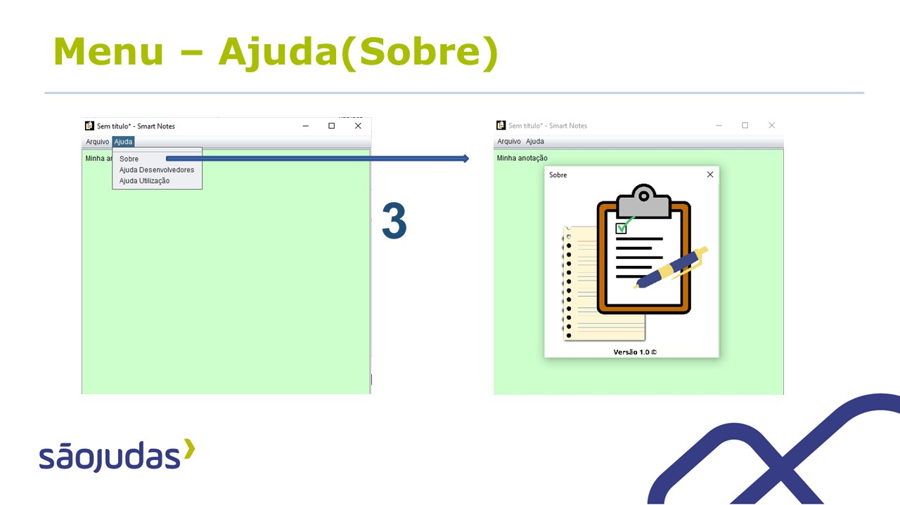

# Smart Notes
O objetivo do projeto é demonstrar o processo de desenvolvimento de software que cuja finalidade seria aplicar os conceitos abordados nas UCs de Programação de soluções computacionais e Modelagem de software. (2º período de 2021)
Software baseado em um editor de texto que permite você gerenciar suas anotações, fazer um controle de suas tarefas e principalmente guardar arquivos de código fonte de programação.
&nbsp;
O logotipo foi desenvolvido no canvas utilizando elementos simples de design. 

---
&nbsp;

Usado a IDE NetBeans para o desenvolvimento do software.

---
&nbsp;

## Diagramas
&nbsp;

---
&nbsp;

---
&nbsp;

---
&nbsp;

## Funcionamento
&nbsp;

---
&nbsp;
&nbsp;

---
&nbsp;
&nbsp;

---
&nbsp;
&nbsp;

---
&nbsp;

# Referências:
SOMMERVILLE, Ian; **Engenharia de Software**. 10º edição. Pearson Universidades, 22 abril de 2019.
PRESSMAN, Roger S; MAXIM, Bruce R; ARAKAKI, Reginaldo. 8º edição. **Engenharia de Software: Uma Abordagem Profissional**. AMGH, 15 janeiro de 2016.